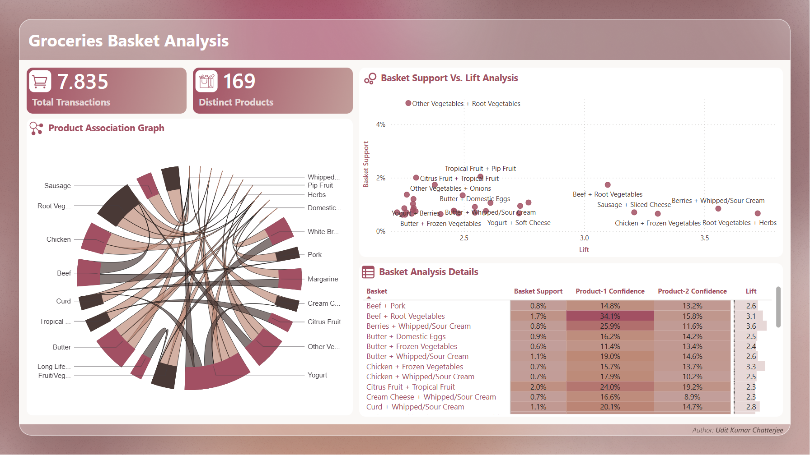

# 🛒 Groceries Basket Analysis – Power BI Report

Welcome to the interactive Power BI dashboard for the Groceries Basket Analysis project! This report visualizes key insights from transactional grocery data, helping you uncover product associations, popular item combinations, and actionable trends for retail decision-making.

---

## 📊 Report Highlights
- **Transaction Overview:** Explore the total number of transactions, unique products, and sales trends over time.
- **Top Products:** Identify the most frequently purchased items and their contribution to overall sales.
- **Basket Analysis:** Discover which products are commonly bought together using market basket analysis visualizations.
- **Association Rules:** Gain insights into product affinities and cross-selling opportunities.
- **Interactive Filters:** Slice and dice the data by product, time period, or transaction segment for deeper exploration.

---

## 🚀 Explore the Power BI Report

  

> **Click the image above or [view the interactive Power BI report here][powerbi_link].**

---

## 📝 How to Use This Report
- **Hover** over charts for tooltips and detailed breakdowns.
- **Click** on visuals or legend items to filter and highlight related data.
- **Use slicers** to focus on specific products, timeframes, or transaction types.

---

## 📥 Data & Methodology
- Data sourced from anonymized grocery transactions.
- Analysis performed using Python (pandas, matplotlib, seaborn) and Power BI.
- For more details, see the [project repository](../README.md).

---

[powerbi_link]: https://app.powerbi.com/view?r=eyJrIjoiMWFlNGE1ZDAtNjg2YS00NTNkLTkwMjgtNzg5OGFkNWIxYWQ1IiwidCI6IjI5MmY4YmYxLTg2NzQtNGM0Ny05Yzk1LWMwNDYzZGQxMGRlNCJ9&embedImagePlaceholder=true&pageName=b67e3f421da06b0c0027
