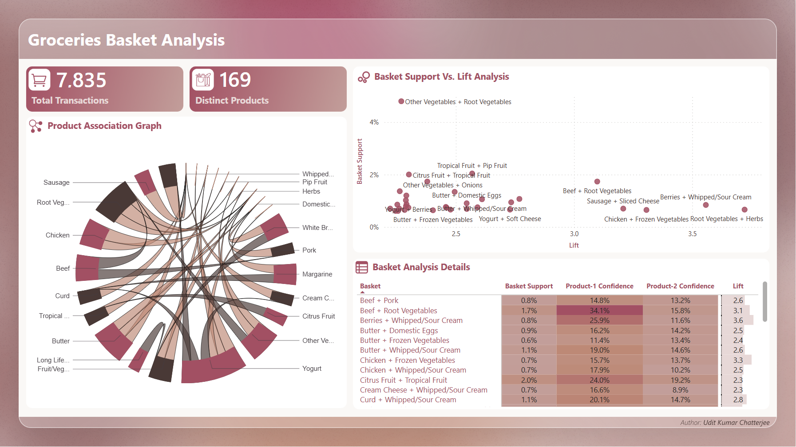

# Groceries Basket Analysis - Power BI Report

The following is the snapshot of the interactive Power BI report to explore insights from the data:

  

> Access the Power BI report either by clicking on the snapshot or, by clicking here: **[Power BI Report][powerbi_link]**

[powerbi_link]: https://app.powerbi.com/view?r=eyJrIjoiMWFlNGE1ZDAtNjg2YS00NTNkLTkwMjgtNzg5OGFkNWIxYWQ1IiwidCI6IjI5MmY4YmYxLTg2NzQtNGM0Ny05Yzk1LWMwNDYzZGQxMGRlNCJ9&embedImagePlaceholder=true&pageName=b67e3f421da06b0c0027